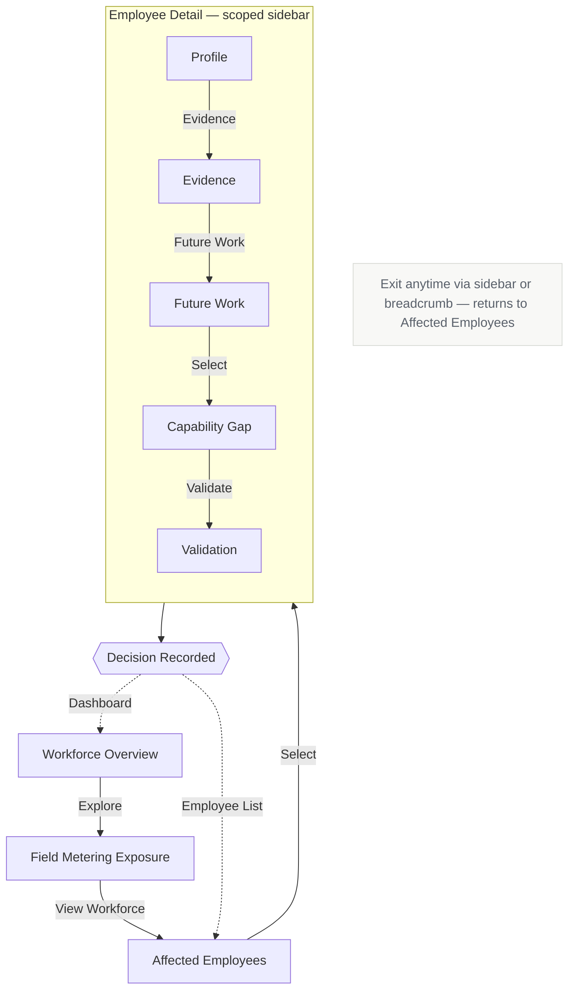

# Workforce Capability Navigator

**Field Metering & Manual Operations — Workforce Transformation Decision-Support Tool**

A single-page frontend prototype that helps a Director of Human Capital trace the impact of automation on a workforce segment — from aggregate exposure, down to an individual employee's capabilities, evidence, future-work fit, and validation status.

## Live Demo

**[https://yanardrognuh.github.io/workforce-capability-navigator/](https://yanardrognuh.github.io/workforce-capability-navigator/)**

Hosted via GitHub Pages. No login, no setup — opens directly in the browser.

---

## Table of Contents

- [Live Demo](#live-demo)
- [1. Project Overview](#1-project-overview)
- [2. Prototype Limitations (What Doesn't Exist)](#2-prototype-limitations-what-doesnt-exist)
- [3. App Architecture & Page Flow](#3-app-architecture--page-flow)
- [4. How This Was Built (AI-Assisted Workflow)](#4-how-this-was-built-ai-assisted-workflow)

---

## 1. Project Overview

**Workforce Capability Navigator** is a frontend decision-support tool for managing workforce transformation in a **Field Metering & Manual Operations** context, where a significant share of manual, route-based work is expected to be automated over the coming 18 months.

Rather than reducing workforce impact to a single automation percentage, the app reframes the problem around individual employees by walking through a structured evaluation chain:

> **Workforce exposure → Employee → Capabilities → Evidence → Future Work → Gap → Recommendation → Validation**

For each employee, the tool surfaces:

- **Current role and work activity** — what the employee does today.
- **Capabilities and levels** — what the employee can do, rated 1–5.
- **Confidence and evidence** — *why* the app believes it (recent work records, training, manager sign-off), separated explicitly from capability level.
- **Future-work matching** — how current capabilities compare against illustrative future roles.
- **Capability gap analysis** — what's confirmed, what needs validation, and what's genuinely missing.
- **A recommended pathway** — `READY`, `RESKILL`, or `REVIEW` — with a plain-language justification rather than an opaque score.
- **A validation checklist and action set** — so a human owns the final call.

The guiding design principle, surfaced directly in the UI, is:

> **AI recommends. People validate. Management decides.**

This is a **decision-support tool**, not a decision-making system. It does not make, imply, or automate employment decisions.

### Tech Stack

| Layer | Technology |
|---|---|
| Structure | Semantic HTML5 |
| Styling | Hand-written CSS3 (custom properties / design tokens, CSS Grid, Flexbox) |
| Behavior | Vanilla JavaScript (ES6+), no framework, no build step |
| Typography | IBM Plex Sans / IBM Plex Mono (Google Fonts, loaded via CDN) |
| Data | Deterministically generated mock JSON, seeded pseudo-random generator |

There are no external JS dependencies, no package manager, and no compilation step — the entire application is one self-contained `.html` file.

---

## 2. Prototype Limitations (What Doesn't Exist)

This project is a **frontend-only prototype** built to demonstrate an interaction model and information architecture — **not** a production system. To avoid any ambiguity about its readiness, the following are explicitly **out of scope** and do not exist in this codebase:

- ❌ **No backend server or API architecture.** There is no Node/Python/Java service, no REST or GraphQL layer, and no server-side routing of any kind. Every interaction is handled client-side in the browser.
- ❌ **No database.** All employee profiles, capability records, evidence entries, regional data, and headline workforce statistics are **hardcoded dummy data**, generated as in-memory JavaScript objects/JSON at page load. Nothing is persisted, queried, or written to disk.
- ❌ **No real machine learning or algorithmic recommendation engine.** The `READY` / `RESKILL` / `REVIEW` outcomes are produced by a small, transparent, deterministic rule-set (e.g., *"zero gaps and zero unvalidated requirements → READY"*) — not by a trained model, embedding similarity, or scoring pipeline. There is no inference call, no model weights, and no AI decision-making at runtime.

Additional boundaries worth noting:

- No authentication, authorization, or user accounts — the app is open by design (no login, per prototype requirements).
- No real HR-system integration (e.g., Workday, SAP SuccessFactors) — all data is fictional and self-contained.
- State (filters, selected employee, recorded decisions) lives only in memory for the current browser session and resets on page reload.
- Task-level automation detail, future-role definitions, and reskilling pathways are explicitly labeled **"Illustrative / Requires Validation"** in the UI, since the underlying case data does not specify them.

---

## 3. App Architecture & Page Flow

### 3.1 Navigation Model

The application follows a **hybrid navigation architecture**, chosen deliberately to keep global structure and employee-specific context from bleeding into each other:

| Layer | Pattern | Pages |
|---|---|---|
| **Global views** | Standalone pages, plain button routing | Workforce Overview, Field Metering Exposure |
| **Master list** | Top-level directory with filters | Affected Employees |
| **Contextual detail** | Master-detail container with a scoped left-hand sidebar (vertical stepper) — only rendered once an employee is selected | Profile → Evidence → Future Work → Gap → Validation |
| **Loop closure** | Success state with explicit exit actions | Validation outcome → Return to Employee List / Back to Dashboard |

Two navigation aids run in parallel:

1. **Breadcrumb trail** (top of screen) — reflects the real context hierarchy (`Workforce Overview / Field Metering Exposure / Affected Employees / Employee 014 / Evidence`). It is absent on the root Overview page and is never a tab bar.
2. **Employee sidebar stepper** — appears **only** inside the Employee Detail container. It is scoped to a single employee and is not a global navigation element. `Gap` and `Validation` steps are locked until a future-work option has been selected.

### 3.2 Page-by-Page Breakdown

| # | Page | Type | Purpose | Key Interactions |
|---|---|---|---|---|
| 1 | **Workforce Overview** | Standalone | Org-wide landing page: headline case facts (52,000 employees, 1,800+ job titles, 45% blank skill records) | `Explore Field Metering` → Page 2 |
| 2 | **Field Metering Exposure** | Standalone | Segment-level exposure facts (~6,000 employees, ~70% automation exposure, ~4,200 roles' worth of work) with illustrative task examples | Back → Page 1 · `View affected workforce` → Page 3 |
| 3 | **Affected Employees** | Master directory | Filterable table of all fictional employees (region, pathway) | Row click → opens Employee Detail (Page 4) · Region/Pathway filters |
| 4 | **Employee Profile** | Nested detail | Current role, current work activities, capability list with level + confidence | Capability row click → Evidence tab |
| 5 | **Evidence** | Nested detail | Per-capability evidence sources and validation status | Switch capability via side nav · `Find future opportunities` → Future Work tab |
| 6 | **Future Work** | Nested detail | 2–3 illustrative future roles compared against the employee's capabilities | Card click → Gap tab (sets active future-work target) |
| 7 | **Capability Gap** | Nested detail | ✓ confirmed / △ needs validation / ✕ gap breakdown against the selected future role, plus a recommended pathway | `Validate pathway` → Validation tab |
| 8 | **Validation** | Nested detail | Checklist of what's confirmed vs. outstanding, plus explicit human actions | `Confirm pathway` / `Request reassessment` / `Flag for review` → Success state |

### 3.3 User Journey Flowchart



**Legend:** Solid arrows trace the primary forward journey. Dashed arrows are the loop-closure return paths from the Validation outcome. The floating note captures the always-available exit (sidebar / breadcrumb) without crossing the main flow.

### 3.4 Recommendation Logic (Transparent Rule-Set)

To keep the "no black-box AI score" principle honest, the pathway recommendation is computed with a simple, inspectable rule applied to the best-matching future-work opportunity:

```
IF employee has fewer than 3 tracked capabilities → REVIEW   (insufficient evidence)
ELSE IF gap == 0 AND needsValidation == 0          → READY
ELSE IF gap <= 1                                    → RESKILL
ELSE                                                 → REVIEW
```

Where `gap` = required capabilities the employee doesn't have at all, and `needsValidation` = required capabilities present but only backed by Medium/Low-confidence evidence.

### 3.5 Running the Prototype

No installation required:

1. Download `workforce-capability-navigator.html`.
2. Open it directly in any modern browser (Chrome, Edge, Firefox, Safari).
3. No login, no build step, no server.

---

## 4. How This Was Built (AI-Assisted Workflow)

This prototype was produced end-to-end through an AI-assisted development workflow, moving from a raw case brief to a deployable static site without a traditional local dev environment. The process broke down into six stages:

### Step 1 — Project Initialization
A dedicated AI project was created and scoped with a clear title and a one-line core description ("a frontend decision-support tool for workforce transformation in Field Metering & Manual Operations"). This framing was used consistently across every subsequent prompt so the AI maintained a stable mental model of *what* was being built and *for whom* (a Director of Human Capital, not an engineer or an employee).

### Step 2 — AI Instruction Configuration
Before any code was generated, custom interaction rules were set to keep output tight and production-relevant:

- Responses constrained to be **concise**, code-first, with minimal preamble.
- Explicit **frontend-only** boundary — no backend, no database, no real inference logic, reinforced on every build request.
- **Modern UI/UX standards** required by default: responsive layout, clear visual hierarchy, accessible contrast, deliberate typography — while avoiding generic "AI-generated" design clichés (gradient orbs, sparkle icons, templated card grids).
- **Dummy data only**, hardcoded as in-memory arrays/objects, with no simulated API calls or backend contracts.

### Step 3 — Context Injection
The AI was fed structured project context rather than a vague prompt, including:

- The **core journey** (`Workforce exposure → Employee → Capabilities → Evidence → Future Work → Gap → Recommendation → Validation`).
- **Page-flow JSON** describing each of the 8 screens, their data shape, and their button-level transitions.
- **Data rules** distinguishing case facts (e.g., 52,000 employees, 45% blank skill records) from illustrative content that had to be explicitly labeled.
- **UX requirements** (plain language over jargon, visible confidence, clickable evidence) and **technical constraints** (single self-contained HTML file, no login, must run reliably offline during a live presentation).

This context was treated as a living spec: as the interaction model was refined (e.g., moving from a flat 8-step tab bar to a master-detail pattern with a scoped sidebar and breadcrumb hierarchy), the AI was given targeted structural change requests rather than full rewrites from scratch, and iterated on the existing codebase in place.

### Step 4 — Documentation
This `README.md` was generated as the final specification artifact — consolidating the project's purpose, explicit limitations, full architecture (including the Mermaid flowchart above), and build methodology into a single document suitable for onboarding a new contributor or reviewer with zero prior context.

### Step 5 — Version Control
A new repository was created on GitHub, and the AI-generated codebase (`index.html` plus this `README.md`) was committed and pushed as the initial commit, establishing a clean baseline for future iteration and change tracking.

### Step 6 — Deployment
The static prototype was published using **GitHub Pages**, pointed at the repository's default branch/root, giving stakeholders a live, shareable URL to click through the full workforce journey without needing to download or run anything locally.

---

*This README documents a prototype built for demonstration and stakeholder review purposes. It is not a production deployment guide.*
